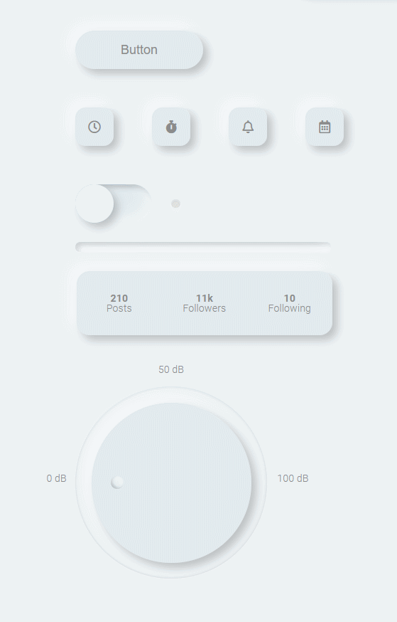

# Neu UI




Crie protótipos e construa projetos mais rápido usando Neu UI - a biblioteca de componentes neumorfos React

## Conteúdos

- ❓ Sobre
- 🚀 Começando
- 📝 Documentação
- 👏 Contribuindo
- ⚖️ Licença

## Sobre

Neu UI começou como um pequeno projeto paralelo explorando o design e o desenvolvimento de componentes de UI usando design neumórfico.

O estilo foi originalmente conceituado por [Alexander Plyuto](https://dribbble.com/alexplyuto) no final de 2019 e o termo "neumorfismo", uma mistura entre esqueumorfismo e _material design_, foi cunhado por Michal Malewicz logo depois.

Para obter mais informações sobre o design, vale a pena dar uma olhada no guia do Alexander Plyuto [aqui](https://www.figma.com/file/J1uPSOY5k577mDpSfGFven/Neomorphism-Guide-2.0-%7C-Original?node-id=26580%3A1425).

Os componentes iniciais agora foram convertidos e estendidos para incluir todo um conjunto de formulários controlados e componentes de cartão em uma biblioteca React. É utilizado React por debaixo dos panos, Storybook como uma ferramenta para visualizar os componentes e Styled Components para definir o estilo dos componentes.

Estamos procurando qualquer pessoa interessada em contribuir, para maiores informações verifique a seção de contribuições abaixo.

## Começando

#### Instalação

Instalando usando `npm`.

```
npm i ui-neu
```

Instalando usando `yarn`.

```
yarn add ui-neu
```

Importando um componente.

```
import { Card } from 'ui-neu'
```

## Documentação

Documentos estão disponíveis e incluem informações sobre propriedades, como começar a contribuir e um guia de contribuição.

[Veja a documentaçao aqui](https://ui-neu.netlify.app/)

## Contribuindo

Se você estiver interessado em contribuir, então qualquer ajuda de documentação, correções de _bugs_ e até mesmo novas melhorias de recursos seja muito bem-vindo!

- _Pull requests_ e ⭐ estrelas são bem vindas!
- Leia o guia [começando a contribuir](./CONTRIBUTING.md) para descobrir maneiras pelas quais você pode começar a contribuir
- Se você está procurando informações mais detalhadas sobre como contribuir, dê uma olhada em nosso [guia de contribuição](/CONTRIBUTING_GUIDE.md)

Procurando por uma primeira _issue_?

- Procure pela label [good first issue](https://github.com/daniel-norris/neu_ui/labels/good%20first%20issue)
- Ainda não está pronto para fazer uma contribuição de código? Dê uma olhada na nossa label [documentation](https://github.com/daniel-norris/neu_ui/labels/documentation)
- Precisa de suporte ou ajuda? Venha até mim, [Dan](https://twitter.com/danielpnorris) no Twitter

## Licença

Esse projeto está sob a licença [MIT](/LICENCE).
